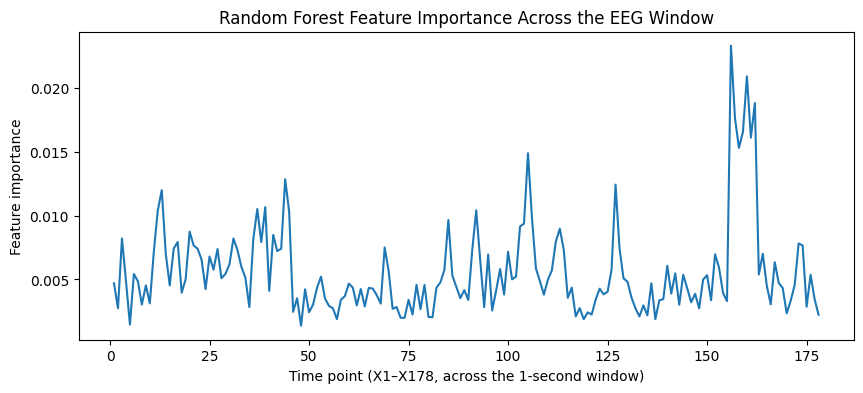

# EEG Seizure Detection Classifier

This project uses one-second EEG segments to classify seizure versus non-seizure brain activity, comparing a simple interpretable baseline against a stronger ensemble model, and evaluating both with metrics appropriate for a highly imbalanced, safety-relevant classification task.

## Goals

- Build an interpretable logistic regression baseline
- Compare it with a random forest
- Evaluate seizure detection using precision, recall, and F1 score
- Discuss limitations and potential neurotechnology applications

## Dataset

**Epileptic Seizure Recognition Data Set** (Andrzejak et al., 2001; re-packaged by Wu, Fokoue & Andrzejak, 2017; UCI Machine Learning Repository).

- 11,500 rows, each representing one second of EEG (178 samples per second, columns `X1`–`X178`)
- Original label `y` has 5 classes:
  - `1` — seizure activity
  - `2`–`5` — non-seizure states (tumor-affected region, healthy region, eyes open, eyes closed)
- Following standard practice for this dataset, the 5-class label was collapsed into a binary `target`: `1` = seizure, `0` = everything else
- Class balance: 9,200 non-seizure vs. 2,300 seizure rows (80% / 20% split)

## Methodology

1. **Train/test split** — stratified 80/20 split to preserve the 20% seizure rate in both sets, avoiding a split that under- or over-represents the minority class.
2. **Feature scaling** — `StandardScaler` fit on the training set only and applied to both sets, to avoid test-set information leaking into scaling parameters. Only used for logistic regression; the random forest was trained on unscaled features, since tree-based splits are scale-invariant.
3. **Regularized linear baseline** — the 178 features are adjacent time points of the same waveform and are highly correlated. Logistic regression therefore uses L2 regularization (`C=0.1`) as a deliberately simple baseline rather than as a physiological model of the waveform.
4. **Two models trained:**
   - Logistic Regression (`C=0.1`, `max_iter=2000`)
   - Random Forest (`n_estimators=200`)
5. **Class imbalance handling** — both models were also retrained with `class_weight="balanced"` to test whether reweighting the minority class improved results.

## Results

### Unweighted models

| Model | Precision (seizure) | Recall (seizure) | F1 (seizure) |
|---|---|---|---|
| Logistic Regression | 1.00 | 0.07 | 0.12 |
| Random Forest | 0.95 | 0.93 | 0.94 |

Logistic regression's near-zero recall despite perfect precision is a textbook symptom of a linear model retreating to the majority class under imbalance — it rarely predicts "seizure" at all, so on the rare occasion it does, it's right, but it misses the vast majority of real seizures. The random forest, by contrast, handled the imbalance well without any special treatment.

### With `class_weight="balanced"`

| Model | Precision (seizure) | Recall (seizure) | F1 (seizure) |
|---|---|---|---|
| Logistic Regression (balanced) | 0.34 | 0.42 | 0.38 |
| Random Forest (balanced) | 0.97 | 0.89 | 0.93 |

Balancing helped logistic regression substantially (F1: 0.12 → 0.38) by forcing it to actually predict the minority class more often, though it remains a weak model overall — the linear decision boundary is a poor fit for this data. The random forest, which was already well-calibrated for the imbalance on its own, saw a slight *decrease* in seizure F1 (0.94 → 0.93) — the reweighting slightly overcorrected a model that didn't need correcting.

**Takeaway:** `class_weight="balanced"` is not a universal fix. Whether it helps depends on whether the model actually struggles with imbalance in the first place. Applying it here without checking both before/after results would have made the random forest marginally worse.

The unweighted random forest was used as the final model going forward.

### Threshold tuning (Random Forest)

The default classification threshold (0.5) is not necessarily the right operating point for a medical detection task, where a missed seizure (false negative) is arguably costlier than a false alarm (false positive).

| Threshold | Precision | Recall | F1 |
|---|---|---|---|
| 0.3 | 0.843 | 0.983 | 0.908 |
| 0.4 | 0.898 | 0.972 | 0.933 |
| 0.5 (default) | 0.949 | 0.939 | 0.944 |

The default threshold gives the best overall F1. However, lowering the threshold to 0.3 pushes seizure recall to 98.3% (missing only ~8 of 460 test seizures) at the cost of precision dropping to 84.3%. The right choice depends on deployment context:

- A system that only reacts internally (e.g. triggering stimulation) can tolerate more false positives → favors a lower threshold.
- A system that raises clinician alerts needs to avoid alert fatigue → favors a higher threshold.

This project reports both operating points rather than picking one arbitrarily.

### Feature importance



Feature importance is distributed across the full one-second window rather than concentrated at a single point, consistent with seizure activity being a sustained pattern rather than an instantaneous event. The most informative region falls late in the window (~X155–163), with secondary peaks earlier on.

**Caveat:** because samples were shuffled and chunked from longer recordings without preserved timing alignment across patients, this should be read as "informative region of this particular window" rather than a claim about seizure physiology or onset timing.

## Limitations

- Binary framing discards information about *why* a sample is non-seizure (tumor region vs. healthy region vs. eyes open/closed) — a more clinically detailed model might treat these as distinct classes.
- No patient-level split — rows from the same original subject may appear in both train and test sets, which can inflate reported performance relative to a true patient-independent deployment.
- Feature-importance timing cannot be linked to physiological seizure onset due to how the dataset was chunked and shuffled.
- This is single-second, non-sequential classification — a real device would need to process a continuous EEG stream, not isolated pre-cut windows.

## Project structure

```
├── data/               # raw CSV (not committed — see Data section)
├── figures/             # saved confusion matrices, threshold plot, feature importance
├── seizure_detection.ipynb  # full analysis
├── requirements.txt     # reproducible Python environment
└── README.md
```

## Run locally

```bash
python3 -m venv .venv
source .venv/bin/activate
python -m pip install -r requirements.txt
curl -L "https://raw.githubusercontent.com/QiuyiWu/Epileptic-Seizure-Recognition-Data/master/A%26B%26C%26D%26E.csv" \
  -o data/epileptic_seizure_data.csv
jupyter lab
```

Open `seizure_detection.ipynb` and run the cells from top to bottom.

## Data source

Wu, Q., Fokoue, E., & Andrzejak, R. G. (2017). *Epileptic Seizure Recognition Data Set*. UCI Machine Learning Repository.

Andrzejak, R. G., Lehnertz, K., Rieke, C., Mormann, F., David, P., & Elger, C. E. (2001). Indications of nonlinear deterministic and finite-dimensional structures in time series of brain electrical activity: Dependence on recording region and brain state. *Physical Review E*, 64, 061907.
